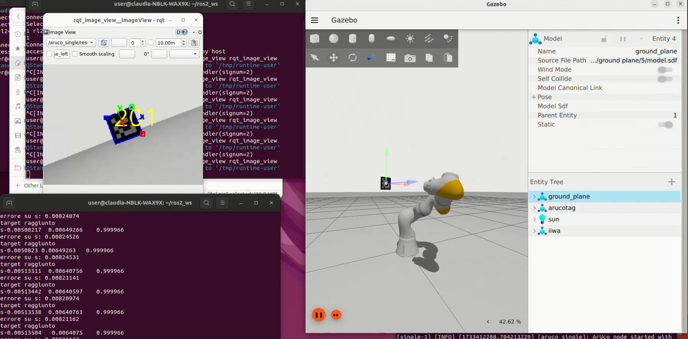

# 🚀 **Homework 3: Vision-Based Control** 🌍🤖 

<p align="center">
  
</p>


Welcome to Homework 3! The primary goal of this Homework is to implement a vision-based controller for a 7-DOF robotic manipulator!  The goal is to use ROS2 packages to detect objects, implement vision-based control, and perform complex trajectories using both joint space and Cartesian space. Below you'll find step-by-step instructions and commands to run various tasks in the Gazebo simulation environment.

---

## 🟢 **FIRST POINT: Creating a Gazebo World** 🛠️

The first step is to create a custom Gazebo world named **`empty_new.world`** containing a blue spherical object. This object will be detected by a camera mounted on the robot’s end-effector and processed using OpenCV for blob detection.

### 1.a ➡️ Launch the Gazebo World
```bash
ros2 launch iiwa_bringup iiwa.launch_new.py command_interface:="velocity" robot_controller:="velocity_controller" use_sim:=true use_vision:=true
```
### 1.b ➡️ Spherical Object View 🌐

Once the world is launched, the robot’s camera is checked to ensure it can "see" the blue spherical object. The real-time image is visualized using the rqt_image_view tool.
```bash
ros2 launch iiwa_bringup iiwa.launch_new.py command_interface:="velocity" robot_controller:="velocity_controller" use_sim:=true use_vision:=true

ros2 run rqt_image_view rqt_image_view
```
### 1.c ➡️ Blob Detection 🔵

Using OpenCV, the node ros2_opencv_node detects the blob of the blue spherical object in the scene. This demonstrates the system’s ability to process images for object detection tasks.
```bash
ros2 launch iiwa_bringup iiwa.launch_new.py command_interface:="velocity" robot_controller:="velocity_controller" use_sim:=true use_vision:=true

ros2 run rqt_image_view rqt_image_view

ros2 run ros2_opencv ros2_opencv_node
```

---

## 🔵 **SECOND POINT: Vision-Based Controller** 🕹️

The second point focuses on implementing a vision-based controller to align the robot’s camera with an ArUco marker. It also explores advanced control using both joint space and Cartesian space.

### 2.a ➡️ Task: Positioning with ArUco Marker 📸

This section spawns a world with an ArUco marker. The robot aligns its camera with the marker by adjusting its position and orientation based on vision feedback. 

```bash
ros2 launch iiwa_bringup iiwa.launch.py command_interface:="velocity" robot_controller:="velocity_controller" use_sim:=true use_vision:=true

ros2 launch aruco_ros single.launch.py marker_size:=0.1 marker_id:=201

ros2 run rqt_image_view rqt_image_view

ros2 run ros2_kdl_package ros2_kdl_vision_control --ros-args -p cmd_interface:=velocity -p task:=positioning
```
📹 Watch the demo on YouTube : https://www.youtube.com/watch?v=dgOmxvEkXrY&feature=youtu.be

### 2.b ➡️ Task: Look at Point with ArUco Marker📌 

In this task, the camera aligns with a specific point in space (e.g., the ArUco marker) by computing the appropriate control commands.

```bash
ros2 run ros2_kdl_package ros2_kdl_vision_control --ros-args -p task:=look-at-point
```
📹 Demo here : https://www.youtube.com/watch?v=EEsBwHIai5A

## 💪 Effort-Based Control 🛠️
This section extends the control capabilities by using the "**effort**" interface for more precise torque-based control.

### 2.c ➡️ Task: Look-at-point with Effort Controller 💪
Launch the simulation:
```bash
ros2 launch iiwa_bringup iiwa.launch.py command_interface:="effort" robot_controller:="effort_controller" use_sim:=true use_vision:=true

ros2 launch aruco_ros single.launch.py marker_size:=0.1 marker_id:=201

ros2 run ros2_kdl_package ros2_kdl_vision_control --ros-args -p cmd_interface:=effort -p task:=look-at-point
```
Replace the effort values to switch to Cartesian torque computation as needed.

📹 Watch the YouTube demo : https://www.youtube.com/watch?v=TxIn_ssuXvQ

### 2.d  ➡️ Task: Linear Position Trajectory 🎯 + Look-at-point Vision 🔍

The robot combines a linear position **trajectory** with the **look-at-point** task.The robot simultaneously tracks a trajectory in space while maintaining visual alignment with an ArUco marker.

Launch the simulation:
```bash
ros2 launch iiwa_bringup iiwa.launch.py command_interface:="effort" robot_controller:="effort_controller" use_sim:=true use_vision:=true

ros2 launch aruco_ros single.launch.py marker_size:=0.1 marker_id:=201

ros2 run ros2_kdl_package ros2_kdl_vision_control --ros-args -p cmd_interface:=effort -p task:=trajectory_lap 
```
> **Note:**  
> The robot will be launched with the **Joint Space controller**.  
---
📹 Check out the video : https://www.youtube.com/watch?v=b3cn5bcMcGs
> **Note:**
> You can go from the Joint Space controller to the **Cartesian Space** controller by changing the code.
